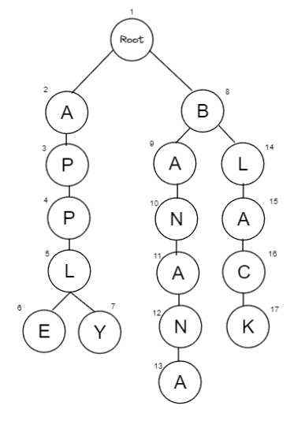

# week12 string 
1. 패턴 매칭
2. Trie

## 문자열 관련 문제 풀이
### ASCII
* A ~ Z : 65 ~ 90
* a ~ z : 97 ~ 122
* ord(), chr()

### string methods
* python이 제공하는 string method 활용
* https://docs.python.org/3/library/stdtypes.html
* startswith
* endswith
* find
* index
* isalpha
* isupper
* islower
* isdecimal
* isdigit
* replace
* strip
* split
* .join
* title

### 패턴 매칭
* p in t : O(N)
* KMP
* Boyer-Moore
* http://whocouldthat.be/visualizing-string-matching/

### KMP Knuth Morris Pratt
* 패턴에 반복이 있는지 확인하고, 검색중 반복되는 만큼 skip
* 반복되는 패턴에 대한 전처리 table LPS (Longest Prefix Suffix) 작성
* 검색에 실패한 지점에서 table의 값 만큼 skip
* O(N + M)
```python
def preProcess(pattern):
    M = len(pattern)
    LPS = [0]*M
    j = 0
    for i in range(1, M):
        while j > 0 and pattern[i] != pattern[j]:
            j = LPS[j-1]
        if pattern[i] == pattern[j]:
            LPS[i] = j+1
            j += 1

    return LPS


def KMP(text, pattern):
    LPS = preProcess(pattern)
    N = len(text)
    M = len(pattern)
    j = 0
    for i in range(N):
        while j > 0 and text[i] != pattern[j]:
            j = LPS[j-1]
        if text[i] == pattern[j]:
            j += 1
        if j == M:
            return True
    return False


text = 'ABC ABCDAB ABCDABCDABDE'
pattern = 'ABCDABD'
```


### 예제
* boj 16916 부분 문자열
* https://www.acmicpc.net/problem/16916

### Boyer-Moore
* 패턴의 뒤부터 확인하여 불일치 하면 패턴만큼 skip
* 보편적으로 사용하는 알고리즘
* 최선 : O(N/M)
* 최악 : O(NM)

## 문자열 처리 자료구조
* 문자열의 삽입 탐색 삭제 수행시 사용할 자료구조
* binary search tree 이진 검색 트리
* hash 해시
* trie 트라이

## Binary Search Tree 이진 검색 트리
* 왼쪽 서브트리의 모든 값은 부모의 값보다 작고,
* 오른쪽 서브트리의 모든 값은 부모의 값보다 큰 이진 트리
* 부모의 값보다 작으면 왼쪽 자식, 크면 오른쪽 자식
* 원소가 크기순으로 정렬
* O(logN)

## Hash 해시
* key-value 로 구성된 자료구조

## Trie 트라이
* 문자열을 효율적으로 처리하기 위한 트리 자료구조
* O(S)
* 메모리가 낭비되어 비효율적
* 삭제가 빈번한 환경에서 비효율적
* 일반적으로는 해시나 이진 검색 트리 사용하는 것이 효율적
* 단 트라이의 성질을 사용해야하는 문제 존재

### 예시
* 
* 삽입
  * APPLE, APPLY, BANANA, BLACK, BAN
* 탐색
  * APPLE, BASE, BAN, APP
* 제거
  * BAN

### 구현
```python
ROOT = 1
unused = 2
MX = 100                            # 최대 등장 가능한 글자 수
chk = [False]*MX                    # 해당 정점이 무자열의 끝인지 여부 저장
nxt = [[-1]*MX for _ in range(26)]  # 해당 정점의 자식 정점 번호 저장 (알파벳 예시)

def c2i(c):                         # 글자를 숫자로 바꿔 배열의 idx로 사용
    return ord(c) - ord('A')        # 'A'의 idx는 0, 'Z'의 idx는 25


def insert(s):                      # 삽입
    global unused

    now = ROOT
    for c in s:
        if nxt[now][c2i(c)] == -1:
            nxt[now][c2i(c)] = unused
            unused += 1
        now = nxt[now][c2i(c)]

    chk[now] = True


def find(s):                        # 탐색
    now = ROOT
    for c in s:
        if nxt[now][c2i(c)] == -1:
            return False
        now = nxt[now][c2i(c)]
    return chk[now]


def delete(s):                      # 삭제
    now = ROOT
    for c in s:
        if nxt[now][c2i(c)] == -1:
            return
        now = nxt[now][c2i(c)]
    chk[now] = False


insert('APPLE')
insert('APPLY')
insert('BANANA')
insert('BLACK')
insert('BAN')
print(nxt[5][4])
print(nxt[5][24])
print(nxt[5][10])
print(chk[6])
print(chk[7])
print(chk[10])

print(find('APPLE'))
print(find('BASE'))
print(find('BAN'))
print(find('APP'))

delete('BAN')
print(chk[10])
print(nxt[9][13])
```

### 예제
* boj 14425 문자열 집합
* https://www.acmicpc.net/problem/14425