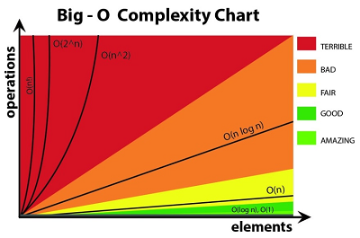
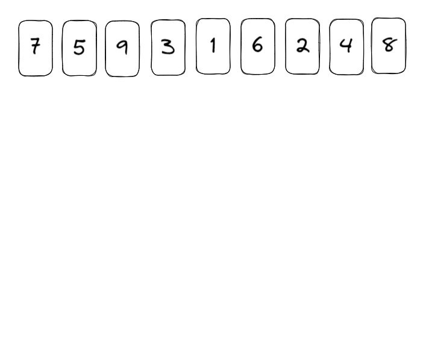

# week1 : Big-O , sort , 수학
## Big-O
* 알고리즘의 성능을 수학적으로 표기
  
* 시간복잡도, 공간복잡도를 표현 가능
  
* 알고리즘의 실제 러닝타임을 표기하는것이라기 보다,
  
* 데이터나 사용자의 증가율에 따른 알고리즘의 성능을 예측하는 것이 목표

* 따라서 알고리즘의 성능을 점근적 표기하기에 상수는 취급x
  * 극한을 생각하면 이해가 쉬울지도?

* 최악의 상황을 고려

* 시스템에 대한 감을 익히기
  * python에서 대충
  * 1M / 1sec : 안정적
  * 10M ~ 50M / 1sec : 대다수 가능
  * 100M / 1sec : 거의 불가능


## 시간복잡도


O(N!) > O(2^N) > O(N^2) > O(NlogN) > O(N) > O(sqrt(n)) > O(logN) > O(1)

### O(1) constant time
* 입력크기에 상관없이 언제나 일정한 시간이 걸리는 알고리즘
```python
# 1부터 N까지 합
def sum_num(N):
    return N * (N + 1) // 2
```
```python
def drop_constant(N):
    for i in range(N):
        print(i)
    for j in range(N):
        print(j)
```
### O(N) linear time
* n번 루프
```python
def point_1d(N):
    point = []
    for i in range(N):
        point.append(i)
    return point
```

### O(N^2) quadratic time
* n x n
```python
def point_2d(N):
    point = []
    for i in range(N):
        for j in range(N):
            point.append([i, j])
    return point
```

### O(NM) quadratic time
* n x m
```python
def point_2d(N, M):
    point = []
    for i in range(N):
        for j in range(M):
            point.append([i, j])
    return point
```

### O(N^3) cubic time / polynomial time
* n x n x n
```python
def point_3d(N):
    point = []
    for i in range(N):
        for j in range(N):
            for k in range(N):
                point.append([i, j, k])
    return point
```

### O(2^N) exponential time
* fibonacci
* 호출할 때마다 두배씩 증가
```python
def fibonacci(N):
    if N == 0 or N == 1:
        return 1
    else:
        return fibonacci(N - 1) + fibonacci(N - 2)
```
### O(M^N) exponential time
* 호출할 때마다 M배씩 증가

### O(logN)
* binary search 이분탐색
* 루프마다 1/2씩 감소
```python
def binary_search(str, end, key, lst):
    mid = int((str + end) / 2)
    if lst[mid] == key: return key
    elif lst[mid] > key: return binary_search(str, mid - 1, key, lst)
    else: return binary_search(mid + 1, end, key, lst)
```
### O(sqrt(N))
* 루프N에 대해 sqrt(N)까지 진행


## 내장 함수 시간 복잡도
* https://wiki.python.org/moin/TimeComplexity
* https://www.ics.uci.edu/~pattis/ICS-33/lectures/complexitypython.txt
---

## sort 정렬
* python에서는 .sort() , sorted() 를 잘 사용하면 된다.
* key= lambda x:x[] 활용하기
* 예제 [단어 정렬 1181](https://www.acmicpc.net/problem/1181)
```python
lst = ['asdf', 'a', 'qwerty', 'bnm']
ret = sorted(lst, key= lambda x : len(x), reverse= False)
```

[sort algorithm](https://gyoogle.dev/blog/algorithm/Bubble%20Sort.html)

* 연습



### bubble sort 거품 정렬
* 인접한 두 원소를 비교하여 정렬
1. 1회차 : 첫 번째, 두 번째 비교 / 두 번째, 세 번째 비교 / ... / n-1 번째, n 번째 비교
2. 1회차 결과 가장 큰 값이 맨뒤로
3. 2회차 : 1.반복 / ... / n-2 번째, n-1 번째 까지
4. 반복
```python
import random
lst = list(range(10))
random.shuffle(lst)
print(lst)

# bubble sort
for i in range(len(lst) - 1, 0, -1):
    for j in range(i):
        if lst[j] > lst[j + 1]:
            lst[j], lst[j + 1] = lst[j + 1], lst[j]

print(lst)
```
* O(N^2)
* stable

### selection sort 선택 정렬
1. 배열에서 최소값/최대값 찾기
2. 그 값을 맨앞/맨뒤와 교체
3. 맨 앞/뒤를 제외한 배열에서 1.반복
4. 반복
```python
import random
lst = list(range(10))
random.shuffle(lst)
print(lst)

# selection sort
for i in range(len(lst)):
    min_index = i
    for j in range(i + 1, len(lst)):
        if lst[min_index] > lst[j]:
            min_index = j
    lst[i], lst[min_index] = lst[min_index], lst[i]

print(lst)
```
* O(N^2)
* unstable

### insertion sort 삽입 정렬
1. 두 번째 원소부터 이전의 원소와 크기비교, 들어갈 위치를 탐색
2. 왼쪽보다 작으면 서로 스왑, 왼쪽보다 크면 정지하고 다음 탐색
3. 세 번째 원소부터 이전의 원소와 크기 비교, 들어갈 위치를 탐색
4. 왼쪽보다 작으면 서로 스왑, 왼쪽보다 크면 정지하고 다음 탐색
5. 반복..
```python
import random
lst = list(range(10))
random.shuffle(lst)
print(lst)

# insertion sort
for i in range(1, len(lst)):
    for j in range(i, 0, -1):
        if lst[j] < lst[j - 1]: 
            lst[j], lst[j - 1] = lst[j - 1], lst[j]
        else:
            break   

print(lst)
```

### merge sort 병합 정렬
1. 배열의 중간을 기준으로 반으로 분할 (분할)
2. 나눠진 배열에서 1.반복 , 배열의 크기가 0이나 1까지
3. 최소 단위로 나눠진 배열의 값을 비교, 정렬 후 배열로 병합 (정복 병합)
4. 다음 단위의 인접한 두 배열 끼리 3.반복 
5. 배열 비교방법 중 하나 투포인터
```python
import random
lst = list(range(10))
random.shuffle(lst)
print(lst)

# merg sort
def mergeSort(lst):
    if len(lst) < 2:
        return lst

    mid = len(lst) // 2
    left_lst = mergeSort(lst[:mid])
    right_lst = mergeSort(lst[mid:])

    merged_lst = []
    l = h = 0
    while l < len(left_lst) and h < len(right_lst):
        if left_lst[l] < right_lst[h]:
            merged_lst.append(left_lst[l])
            l += 1
        else:
            merged_lst.append(right_lst[h])
            h += 1
    
    merged_lst += left_lst[l:]
    merged_lst += right_lst[h:]
    return merged_lst

print(mergeSort(lst))
```

* 평균 : O(NlogN)
* stable

### quick sort 퀵 정렬
* 배열에서 하나의 원소를 선택 (피봇)
* 해당 원소를 기준으로 기준보다 작은 수는 앞으로, 큰 수는 뒤로 정렬
* 기준원소 앞 배열, 뒤 배열에서 각각 1. 반복

1. 기준이 될 원소를 선택 (pivot 선택)
2. 왼쪽부터 탐색하여 pivot보다 큰 값을 선택
3. 오른쪽부터 탐색하여 pviot보다 작은 값을 선택
4. 두 값을 교환
5. 2.부터 반복... (sort)
6. 왼쪽탐색과 오른쪽탐색이 겹치게 되면, 작은 값을 pivot과 교환
7. pivot을 기준으로 왼쪽 배열, 오른쪽 배열로 나뉨 (partiton)
8. 각각 왼쪽/오른쪽 배열에서 1부터 반복(재귀)...
```python
import random
lst = list(range(10))
random.shuffle(lst)
print(lst)

# quick sort
def quickSort(lst):
    def sorted_lst(left, right):
        if left >= right: return      # base case

        mid = partition(left, right)  # pivot을 기준으로 앞 뒤 배열에서 정렬 : 재귀
        sorted_lst(left, mid - 1)          
        sorted_lst(mid, right)

    def partition(left, right):
        # 최악의 경우를 피하기위해, pviot을 정하는 여러 방법이 있다
        # pivot = low                   # pivot으로 첫 번째 원소를 설정
        # pivot = random.choice(lst)    # pivot으로 랜덤값을 설정
        pivot = lst[(left + right) // 2]       # pivot으로 중앙값을 설정
        while left <= right:
            while lst[left] < pivot:
                left += 1

            while lst[right] > pivot:
                right -= 1
            
            if left <= right:
                lst[left], lst[right] = lst[right], lst[left]
                left, right = left + 1, right - 1
        
        return left
    return sorted_lst(0, len(lst) - 1)

quickSort(lst)
print(lst)
```

#### pythonic한 방법
```python
import random
lst = list(range(10))
random.shuffle(lst)
print(lst)

# quick sort
def quick_sort(lst):
    if len(lst) <= 1:
        return lst
    pivot = lst[0]
    others = lst[1:]

    left_lst = [x for x in others if x <= pivot]
    right_lst = [x for x in others if x > pivot]

    return quick_sort(left_lst) + [pivot] + quick_sort(right_lst)

print(quick_sort(lst))
```
* 평균 : O(NlogN)
* 최악 : O(N^2)
* unstable
* 최악을 피하기 위해서 피봇을 랜덤 혹은 중앙값

### 기타 다른 정렬
### counting sort
* 주어진 배열에 원소의 중복 개수를 세어 count 배열을 만들고
* 중복된 원소의 개수 값을 이용하여 정렬
1. 원소의 값에 해당하는 idx에 count[idx]++ 하여 중복된 개수 저장
2. coutn 배열을 idx = 0부터 누적합으로 수정
3. 주어진 배열을 끝에서부터 탐색, 해당 값을 idx로 하는 count[idx]-- 하고
4. count[idx]-- 값을 idx로 하는 반환 배열에 탐색된 값을 저장
```python
import random
lst = list(range(10))
random.shuffle(lst)
print(lst)

def countingSort(lst):
    n = len(lst)
    c = [0]*(n+1)
    ret = [0]*n

    for i in range(len(lst)):
        c[lst[i]] += 1

    for i in range(1, len(c)):
        c[i] += c[i-1]

    for i in range(n-1, -1, -1):
        c[lst[i]] -= 1
        ret[c[lst[i]]] = lst[i]

    return ret

print(countingSort(lst))
```
* O(N + K)
  * N : 리스트 길이
  * K : 정수의 최대값
* N이 작을 때 유용


### heap sort
* [heap sort](./week2_datastructure.md)
* heap 구조를 이용한 정렬
* heapq는 min heap이 default (오름차순)
1. heappush하여 원소 추가
2. 최소값이 제일 위로 가도록 heap 구조 정렬
3. 젤 위의 값(최소값)을 heappop 하여 반환 배열에 추가
```python
import random
lst = list(range(10))
random.shuffle(lst)
print(lst)

from heapq import*

def heapsort(lst):
    h = []
    ret = []
    for value in lst:
        heappush(h, value)
    
    ret = [heappop(h) for i in range(len(h))]
    
    return  ret

print(heapsort(lst))
```

### 정렬 알고리즘 비교
|알고리즘|평균|최악|방법|특징|
|:--|:--|:--|:--|:--|
|bubble sort|O(N^2)|O(N^2)|비교, 교환|구현이 쉽지만 느림|
|selection sort|O(N^2|O(N^2)|비교, 교환|교환의 회수가 적다|
|insertion sort|O(N^2)|O(N^2)|비교, 교환|n이 작을 때 유용|
|merge sort|O(NlogN)|O(NlogN)|분할, 정복|linked list 경우 가장 효율적|
|quirck sort|O(NlogN)|O(N^2)|분할, 정복|가장 빠른 정렬|
|counting sort|O(N+K)|O(N+K)|비교환|n이 작을 때 유용|

* stable, unstable
* 장단점
* 용도
---

## 수학
* 간단한 기초 수학으로 문제를 쉽게 풀어보자!

### n진법
* n진법 변환으로 거듭제곱의 연산을 간소화할 수 있다.

123 = 1 x 100 + 2 x 10 + 3 x 0

123 = (((0 x 10 + 1) x 10) + 2) x 10 + 3 

* 예제 [곱 1629](https://www.acmicpc.net/problem/1629)

* A^11 / 12

* A * A^2 * A^8
```python
def cal_power(a, b, c):
    ret = 1
    while b:
        if b % 2 == 1: ret *= a
        a = a * a
        b //= 2
    return ret % c

cal_power(10, 11, 12)
```
```python
# 큰 수끼리의 곱이 느려, 아래가 좀 더 빠름
def cal_power(a, b, c):
    ret = 1
    while b:
        if b % 2 == 1: ret = ret * a % c
        a = a * a % c
        b //= 2
    return ret

cal_power(10, 11, 12)
```

### LCM 최소공배수 , GCD 최대공약수
* 예제 [최대공약수와 최소공배수 2609](https://www.acmicpc.net/problem/2609)
* LCM 최소공배수
  * 공통적인 배수 중 최소값
  * LCM(a , b) = a x b / GCD(a , b)
  * GCD를 알면 O(1)으로 계산 가능

* GCD 최대공약수
  * 공통적인 약수 중 최대값이 1이면 서로소

```python
def gcd(a, b):
    ret = 0
    for i in range(min(a, b)):
        if a % i == 0 and b % i == 0:
            ret = i
    return ret
```
```python
# target의 위치를 예상하면 더 빠르게 짤 수 있다
def gcd(a, b):
    for i in range(min(a, b), 0, -1):
        if a % i == 0 and b % i == 0:
            return i
```

* 유클리드 호제법
  * GCD(a , b) = GCD(b , a % b)

```python
def gcd(a, b):
    return b if a % b == 0 else gcd(b, a % b)
```

### 소수 판별법
* 예제 [소수 찾기 1978](https://www.acmicpc.net/problem/1978)
* 소수 판별
```python
# O(N)
def isPrime(N):
    if N == 1: return False
    for i in range(2, N):
        if N % i == 0: return False
    return True

# O(sqrt(N))
def isPrime(N):
    i = 2
    while i * i <= N:
        if N % i == 0: return False
        i += 1
    return True
```
* sqrt(N)까지 검사

* 예제 [소수 구하기 1929](https://www.acmicpc.net/problem/1929)
* 에라토스테네스의 체
  * N까지의 소수를 구하려면 sqrt(N)까지의 소수의 배수를 제거
```python
# Nlog(log(N))
def eratos(N):
    check, prime = [False for _ in range(N + 1)], []
    for i in range(2, N + 1):
        if check[i] == True: continue
        prime.append(i)
        for j in range(i * i, N + 1, i):
            check[j] = True
    return check, prime

print(eratos(50))
```
```python
# Nlog(log(N))
def eratos(N):
    prime = [True for _ in range(N + 1)]
    prime[0] = False
    prime[1] = False
    for i in range(2, int(N**0.5) + 1):
        if prime[i] == False: continue
        for j in range(i * i, N + 1, i):
            prime[j] = False
    return prime

print(eratos(50))
```
### 재귀함수
* 예제 [하노이 탑 11729](https://www.acmicpc.net/problem/11729)
* 점화식
  * F(N) = 2 x F(N - 1) + 1 , F(1) = 1
```python
def hanoi(st, ed, sz):
    if sz == 1: return print(st, ed)
    hanoi(st, 6-st-ed, sz-1)
    print(st, ed)
    hanoi(6-st-ed, ed, sz-1)

n = int(input())
print(2**n-1)
hanoi(1, 3, n)
```


## 참고
* [Big O notation](https://www.youtube.com/watch?v=6Iq5iMCVsXA)
  
* [수학](https://www.youtube.com/watch?v=t_Ezo4NksZY&list=PL9mhQYIlKEhfg0aLdaO04wYUovLMXY4DU&index=4)
  
* [정렬 알고리즘](https://www.youtube.com/watch?v=KGyK-pNvWos&list=PLRx0vPvlEmdAghTr5mXQxGpHjWqSz0dgC&index=4)