# week2 : Data Structure

## 자료 구조
* 자료를 저장하는 방법
* 효율성, 재사용성, 추상화
* 메모리 관리를 효율적으로!

## array 배열
* 같은 타입의 변수들로 이루어진 유한집합
* 같은 타입의 데이터를 나열한 sequence container
* 연속된 메모리 공간에 순차적으로 저장
* index로 접근하여 속도가 빠름
* 기록밀도가 1

* 크기가 고정
* 삽입과 삭제가 어렵고 오래 걸림
* 공간 낭비가 발생

## list (array list)
* array를 보완한 자료구조
* 배열을 이용해 리스트를 구현
* index로 접근이 빠름

* 크기가 가변적
* 데이터를 삭제해여도 연속적으로 위치
* 데이터의 삽입 삭제가 느림
  * 순서를 조정하는 연산, 메모리 낭비

## linked list
* 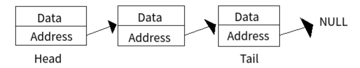
* 노드의 연결로 구현한 리스트
* 각 노드는 데이터 값과 다음 노드에 대한 주소(참조)로 구성
* 종류 : single, double, circular
* 한 원소에서 값과 다음 원소의 주소를 연결하는 방식
* 연속되지 않은 메모리 위치여서 index 사용이 불가능
* 순차적으로 접근해 속도가 느림

* 크기가 가변적
* 삽입과 삭제가 쉬움
* 논리적 저장순서와 물리적 저장 순서가 일치하지 않는다

## array vs array list vs linked list
* 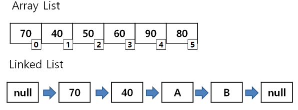


## stack
## LIFO : Last In, First Out
## FILO : First In, Last Out
* 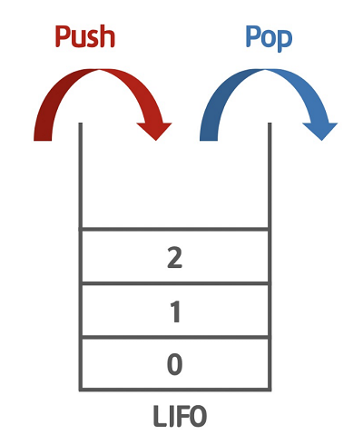
* 데이터를 임시 저장할 때 사용하는 자료구조
* 파이썬에서는 **그냥 list 사용**
* push : stack에 데이터를 추가
* pop : stack의 top 데이터를 제거
* top : stack의 가장 위(최근) 데이터 위치
* bottom : stack의 가장 아래(예전) 데이터 위치
* isempty
* isfull
* size
* [stack 구현 10828](https://www.acmicpc.net/problem/10828)
```python
class Stack:
    def __init__(self):
        self.length = 0
        self.stack = []
    
    def push(self, data):
        self.stack.append(data)
        self.length += 1

    def pop_stack(self):
        if self.size() == 0:
            return -1
        pop_data = self.stack[len(self.stack)- 1]
        self.length -= 1
        del self.stack[self.length]
        return pop_data

    def size(self):
        return self.length
    
    def empty(self):
        return 1 if self.length == 0 else 0

    def top(self):
        return self.stack[-1] if self.size() != 0 else -1
```
### 사용 예시
* 함수의 콜스택 (재귀)
* 웹 브라우저 방문기록, 뒤로가기
* 실행취소 ctrl + z
* 괄호 검사
* 후위 표기법
* DFS

* [연습 문제 9012](https://www.acmicpc.net/problem/9012)
* 예외 케이스 생각
  * ( 없는데, ) 가 들어오는 경우
  * ( 만 들어오는 경우 , 들어올 ) 가 없는 경우

## queue
## FIFO : First In, First Out
* 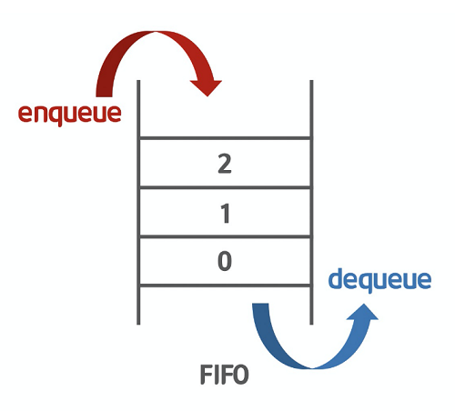
* 데이터를 임시 저장할 때 사용하는 자료구조
* from collections import deque 추가해서 **<u>deque로 사용</u>**
* enqueue : queue에 데이터를 추가
* dequeue : queue의 front 데이터를 제거
* front : queue의 가장 아래(예전) 데이터 위치
* rear : queue의 가장 위(최근) 데이터 위치
* isemty
* isfull
* size
* (+) 링 버퍼 (원형 큐) : 배열의 처음과 끝이 연결된 것으로 간주 
```python
class Queue:
    def __init__(self):
        self.length = 0
        self.queue = []
    
    def push(self, data):
        self.queue.append(data)
        self.length += 1

    def pop_queue(self):
        if self.size() == 0:
            return -1
        pop_data = self.queue[0]
        self.length -= 1
        del self.queue[0]
        return pop_data

    def size(self):
        return self.length
    
    def empty(self):
        return 1 if self.length == 0 else 0

    def front(self):
        return self.queue[0] if self.size() != 0 else -1

    def back(self):
        return self.queue[-1] if self.size() != 0 else -1
```

### 사용 예시
* 우선순위가 같은 작업
* 순차적으로 처리해야하는 일
* 놀이공원, 웨이팅, 인쇄 대기열...
* cache
* BFS

## deque
* stack + queue
* from collections import deque 추가해서 **<u>deque로 사용</u>**
* push_front
* push_rear
* pop_front
* pop_rear
* front
* rear
* isempty
* isfull
* size

### 메서드
* [python doc - deque](https://docs.python.org/ko/3/library/collections.html)

|deque.메서드|의미|
|:---|:---|
|.copy()|얕은 복사본을 반환|
|.append()|오른쪽에 추가|
|.appendleft()|왼쪽에 추가|
|.extend(iterable)|오른쪽에 추가|
|.extendleft(iterable)|왼쪽에 추가|
|.pop()|오른쪽 제거후 반환, 없으면 IndexError|
|.popleft()|왼쪽 제거후 반환, 없으면 IndexError|
|.celar()|0으로 초기화|
|.count(x)|x의 개수|
|.index(x [, start[, stop]]| (start 이후 stop 이전에서) x의 index 반환, 없으면 ValueError|
|.insert(index, x)|index에 x 삽입|
|.remove()|왼쪽부터 첫 번째 항복 제거, 없으면 ValueError|
|.reverse()|순서 뒤집기, None 반환|
|.rotate(n)|n 스텝만큼 오른쪽으로 회전, n이 음수이면 왼쪽으로 회전|

```python
# deque example
from collections import deque

d = deque()
d.append('a')
d.appendleft('b')
d.extendleft('cde')
print(d)
d.rotate()
print(d)
print(d.popleft())
print(d.pop())
```

* [연습문제 11866](https://www.acmicpc.net/problem/11866)

## hash
* 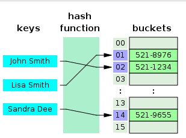
* 데이터 관리, 유지를 위한 자료구조
* 리소스를 포기한 대신 속도가 빠르다
* 파이썬에서는 **그냥 dict 사용** 또는,,,
  * .setdefault(), .get(), .pop(), .update(), .del()
* from collections import defaultdict **<u>defaultdict 사용</u>**
  * 존재하지 않는 key 사용 시
  * 설정한 default를 value로 새로운 key/value 쌍 추가
  ```python
  from collections import defaultdict
  
  # 10을 default로 설정
  def default(): 
      return 10
  d2 = defaultdict(default)
  
  # int는 0을 반환
  d = defaultdict(int)
  d[0] = 10
  
  print(d)
  print(d[10])
  print(d)
  
  ##### 출력
  # defaultdict(<class 'int'>, {0: 10})
  # 0
  # defaultdict(<class 'int'>, {0: 10, 10: 0})
  ```
* 예제
* 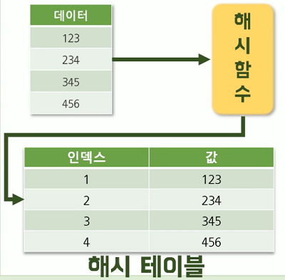
* 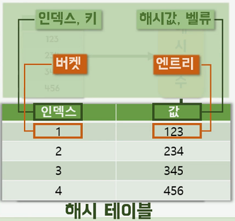

### collision
* 해쉬충돌
* 해결방법
* separate chaining
  * 
* open addresing
  * linear probing
  * 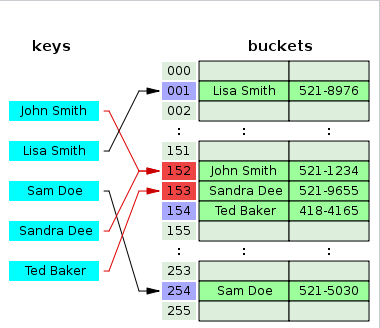
  * quadratic probing
  * double hashing

## tree
* 
* 상위/하위 관계를 나타내는 데이터 구조
* node 와 edge로 구성

### terminology
* root : 최상위
* leaf node : 최하위
* parent : 부모
* child : 자식
* sibling : 형제
* ancester : root까지의 경로에 있는 node들
* descendant : subtree의 모든 node들
* subtree 
* degree
* level : root가 level 0
* height : max level

### 저장 방법
```python
tree = [0, 1, 1, 2, 2, 5, 5, 5]
```
* 부모를 저장
  * 1차원 배열 (1개만 저장)
  * 8의 조상은??
    * 5 -> 2 -> 1

```python
tree = [[2, 3], [4, 5], [], [], [6, 7, 8], [], [], []]
```
* 자식 저장
  * root부터 탐색에 유용
  * 재귀(순환)를 사용할 때 유용

* 예제
* [촌수계산 2644](https://www.acmicpc.net/problem/2644)


## binary tree 이진트리
* 
* 자식 노드의 최대 개수가 2
* 부모 x에 대해, 왼쪽 자식은 2x, 오른쪽 자식은 2x+1
* 2x , 2x+1 , //2 의 성질을 이용
* 예제
* [30번 13116](https://www.acmicpc.net/problem/13116)

## heap
```python
lst = [3, 9, 2, 1, 4, 5]
```
* 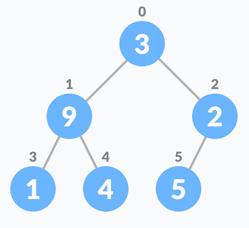
* 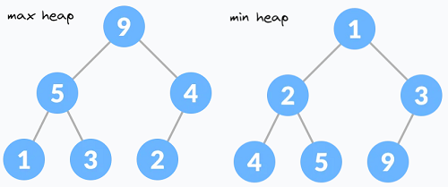
* heap 특성을 가지는 완전 이진 트리 자료구조
* a complete binary tree that satisfies the heap property
* max heap : 부모가 자식보다 항상 크다
* min heap : 부모가 자식보다 항상 작다
* leaf node 바로 이전의 index부터 index 0까지
  * index n//2 부터 heapify
  * ex) 2부터 시작 0까지
  * [heap visualization](https://www.cs.usfca.edu/~galles/visualization/Heap.html)
* 파이썬에서 사용할 때는 **from heapq import***
* 파이썬의 heap은 min-heap (오름차순)
* [python heapq](https://docs.python.org/3/library/heapq.html)
  * heappush
  * heappop
  * heappushpop
  * heapify
 
### heap sort
* 반정렬, 느슨한 정렬
* max/min 값 몇개를 가져와야 할 때 유용
* O(NlogN)
```python
# heap sort
from heapq import*

def heapsort(iterable):
    h = []
    for value in iterable:
        heappush(h, value)
    return [heappop(h) for i in range(len(h))]

heapsort([1, 3, 5, 7, 9, 2, 4, 6, 8, 0])
```
```python
h = []
heappush(h, (5, 'write code'))
heappush(h, (7, 'release product'))
heappush(h, (1, 'write spec'))
heappush(h, (3, 'create tests'))
heappop(h)  # (1, 'write spec')
```

## priority queue 우선순위 큐
* 우선순위가 가장 높은 데이터부터 삭제하는 자료구조
* 우선순위에 따라 처리하고 싶을 때 사용

## bianry search tree (bst) 이진 검색 트리
* 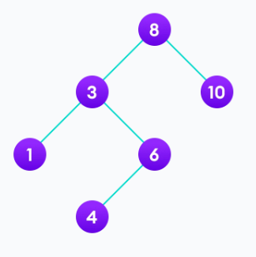
* root, node보다 작으면 왼쪽
* root, node보다 크면 오른쪽
* sub tree도 항상 bst 이다
* 최악의 경우를 피하기 위해 다양한 트리가 존재
  * AVL tree
  * splay tree
  * redblack tree
* O(logN)

## 참고
* [progrmiz](https://www.programiz.com/dsa/heap-data-structure)