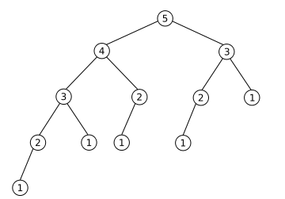

# week3 : Dynamic Programming

## DP 동적 계획법
* 여러 개의 작은 문제를 풀고, 그 결과를 쌓아서 큰 문제를 해결하는 알고리즘
* recurrence relation
* 점화식 : 인접한 항들 사이의 관계식
* 해결된 작은 문제는 저장하여 다시 계산 x
* 상향식, 하향식

## DP 문제 판단
1. 최적 부분 구조 : 큰 문제를 작은 문제로 나눔
2. 부분 문제 중복 : 동일한 작은 문제가 반복적으로 나타남

   vs 분할 정복

## Memoization
* 작은 문제를 계산한 결과를 메모리 공간에 메모
* 작은 문제가 호출되면 결과를 바로 사용
* caching 캐싱
* dp 테이블 : d, dp, memo, cache

## top-down vs bottom-up
* bottom-up이 dp문제의 일반적인 풀이 방법

## DP를 푸는 과정
1. 테이블
2. 점화식 
3. 초기값

## fibonacci

* 최적 부분 구조 : a5 = a4 + a3
* 부분 문제 중복 : a3 중복

```python
# recursion
def fibo(a):
    if a == 1 or a == 2:
        return 1
    else:
        return fibo(a-1) + fibo(a-2)

# print(fibo(100))
```
```python
# top-down
d = [0]*101

def fibo(a):
    if a == 1 or a == 2:
        return 1

    if d[a] != 0:
        return d[a]

    d[a] = fibo(a-1) + fibo(a-2)
    return d[a]

print(fibo(100))
```
```python
# bottom-up
d = [0]*101

d[1] = 1
d[2] = 1

n = 100
for i in range(3, n+1):
    d[i] = d[i-1] + d[i-2]

print(d[n])
```
* O(N)

## [연습 문제](https://github.com/encrypted-def/basic-algo-lecture/blob/master/workbook/0x10.md)


## 참고
[baaarkingdog](https://www.youtube.com/watch?v=5leTtB3PQu0)