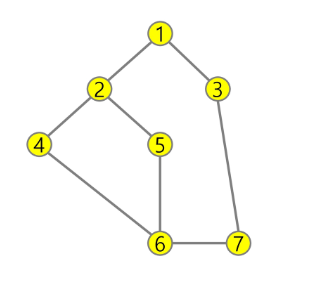

# week4 : DFS, BFS

## graph

### 인접 리스트
```python
[[], [2, 3], [1, 4, 5], [1, 7], [2, 6], [2, 6], [4, 5, 7], [3, 6]]
```
### 인접 행렬
```python
[
    [0, 0, 0, 0, 0, 0, 0, 0], 
    [0, 0, 1, 1, 0, 0, 0, 0], 
    [0, 1, 0, 0, 1, 1, 0, 0],
    [0, 1, 0, 0, 0, 0, 0, 1],
    [0, 0, 1, 0, 0, 0, 1, 0],
    [0, 0, 1, 0, 0, 0, 1, 0],
    [0, 0, 0, 0, 1, 1, 0, 1],
    [0, 0, 0, 1, 0, 0, 1, 0]
]
```
## DFS Depth First Search 깊이 우선 탐색
1. 탐색할 노드를 스택에 삽입, 해당 노드의 방문 기록
2. 원소의 인접 노드에 대해...
3. 이전에 방문하지 않았다면, 스택에 삽입 방문 기록 후 해당 원소에 대해 2. 반복
4. 모든 인접노드에 대해서 방문하였다면 stack에서 제거
5. stack이 빌 때 까지 반복
```python
def DFS(v, visited, graph):
    visited[v] = Trye
    for i in graph[v]:
        DFS(i, visited, graph)
```
```python
def DFS(v, visited, graph):
    stack = [v]
    while stack:
        v = stack.pop()
        if not visited[i]:
            visited[v] = True
            for i in graph[v]:
                if not visited[i]:
                    stack.append(i)
```
* stack 사용
* 반복, 재귀로 구현

## BFS Breath First Search 너비 우선 탐색
1. 탐색 시작 노드를 큐에 삽입, 해당 노드의 방문 기록
2. 큐에서 원소를 꺼내, 원소의 모든 인접 노드에 대해...
3. 이전에 방문하지 않았다면, 큐에 삽입 방문 기록 후 2. 반복
4. 큐가 빌 때 까지 반복
```python
def BFS(v, visited, graph):
    queue = deque([v])
    visited[v] = True
    while queue:
        v = queue.popleft()
        for i in graph[v]:
            if not visited[i]:
                queue.append(i)
                visited[i] = True
```
* queue 사용
* 반복으로 구현

## 문제 유형
### DFS
* 검색 대상 그래프가 큰 경우
* 각각의 경로를 저장해야하는 경우
* 경로의 개수를 구해야하는 경우

### BFS
* 최단경로
* 여러 정점에서 확산

## graph
* directed graphs
* adjecency lists
* undirected graphs