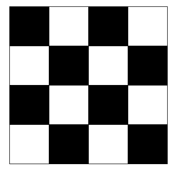

# week6 backtracking
1. 백트래킹
   1. 개념 복습
   2. 교재 예제
   3. 연습 문제 풀어보기
      1. n,m
      2. nqueen
      3. 부분수열합
2. 순열과 조합
3. 분할 정복

## backtracking
* 현재에 상태에서 가능한 모든 후보군 탐색하는 도중, 
* 유망하지 않다고 판단되면 되돌아가서 다시 탐색하는 알고리즘
* 백트래킹 알고리즘
  1. DFS : 상태 공간 트리의 깊이우선탐색 실시
  2. promising : 어떤 노드의 유망성을 검사
  3. prunning : 유망하지 않다고 판단되면 탐색 중단 후
  4. backtracking : 부모 노드로 **되돌아가서** 다음 자식 노드 탐색
* 수도 코드
  * 교재 예시
  * 흐름만 체크하기!!
```python
def backtracking(arr, idx, input):
    global MAXCANDIDATES
    candidate = [0] * MAXCANDIDATES

    if idx == input:
        # process
        print(arr)
    else:
        idx += 1
        candidates = constructCandidates(arr, idx, input, candidate)
        for i in range(candidates):
            arr[idx] = candidate[i]
            backtracking(arr, idx, input)

# 부분집합 문제
def constructCandidates(a, k, input, candidate):
    candidate[0] = 1
    candidate[1] = 0
    return 2

# 순열 문제
def constructCandidates(arr, idx, input, candidate):
    in_perm = [False] * NMAX

    for i in range(1, idx):
        in_perm[arr[i]] = True
    
    candidates = 0
    for i in range(1, input+1):
        if in_perm[i] == False:
            candidate[candidates] = i
            candidates += 1

    return candidates

# MAXCANDIDATES = 2
MAXCANDIDATES = 3
NMAX = 4
arr = [0]*NMAX
backtracking(arr, 0, 3)
```
```python
# 부분집합
# {1, 2, 3}의 부분집합

# [0, 1, 1, 1]
# [0, 1, 1, 0]
# [0, 1, 0, 1]
# [0, 1, 0, 0]
# [0, 0, 1, 1]
# [0, 0, 1, 0]
# [0, 0, 0, 1]
# [0, 0, 0, 0]

# 순열
# {1, 2, 3}을 포함하는 순열 생성

# [0, 1, 2, 3]
# [0, 1, 3, 2]
# [0, 2, 1, 3]
# [0, 2, 3, 1]
# [0, 3, 1, 2]
# [0, 3, 2, 1]
```

## 예제
* optimization 문제와 decision 문제 풀이에 사용
  * ex) 가장 짧은 거리?, 경로가 존재?
  * 미로 찾기
  * n-Queen
  * Map coloring
  * subset sum

### n과 m 시리즈 (순열, 조합)
* {1, 2, 3}의 순열
```python
def nPr(i, N):
    if i == N:                      # 순열 완성 
        result.append(P)
        print(P)
    else:
        for j in range(i, N):       # P[i]에 들어갈 P[j] 결정
            P[i], P[j] = P[j], P[i]
            nPr(i+1, N)
            P[i], P[j] = P[j], P[i]

result = []
P = [1, 2, 3, 4]
nPr(0, 4)
```
* 연습문제 boj 15649
* https://www.acmicpc.net/problem/15649
```python
def func(k):
    if k == M:
        print(arr)
        return
    
    else:
        for i in range(1, N+1):
            if not visited[i]:
                arr[k] = i
                visited[i] = True
                func(k+1)
                visited[i] = False

N, M = map(int, input().split())

visited = [False]*(N+1)
arr = [0]*(N+1)
func(0)
```

### n-Queen
* n-Queen 문제
* 
```python
# pseudo code

def checknode(v):
    if promising(v):
        if v is_sol:
            process
        else:
            for u in child of v:
                checknode(u)
```
```python
# pseudo code

def checknode(v):
    if v == N:
        cnt += 1
        return
    
    for i in range(N):
        if promising(v):
            visited[v] = True
            checknode(v+1)
            visited[v] = False
```
* 연습문제 boj 9663
* https://www.acmicpc.net/problem/9663

### 부분수열의 합
* 예제 : {1 ~ 10} 의 부분집합 중 합이 10인 부분집합
```python
def subsetSum(i, N):
    global result
    if i == N:
        temp = 0
        for i in range(N):
            if bit[i]:
                temp += A[i]

        if temp == 10:      # 합이 10이면 개수 추가
            result += 1
            for i in range(N):
                if bit[i]:
                    print(A[i], end=' ')
            print()
    else:
        bit[i] = 1          # A[i]가 부분집합에 포함된 경우
        subsetSum(i+1, N)
        bit[i] = 0          # A[i]가 부분집합에 포함되지 않은 경우
        subsetSum(i+1, N)

A = [1, 2, 3, 4, 5, 6, 7, 8, 9, 10]
bit = [0]*len(A)
result = 0

subsetSum(0, 10)
print(result)
```
```python
def subsetSum(i, N, s, t):
    global result, cnt
    cnt += 1
    rest_sum = sum(A[i:])
    if i == N:                              # 모든 원소를 확인
        if s == t:                          # 부분집합의 합이 t이면
            result += 1
        return
    elif s > t:
        return
    elif s + rest_sum < t:
        return
    else:
        subsetSum(i+1, N, s+A[i], t)        # A[i]가 포함된 경우 
        subsetSum(i+1, N, s, t)             # A[i]가 포함되지 않은 경우

A = [1, 2, 3, 4, 5, 6, 7, 8, 9, 10]
bit = [0]*len(A)
result = 0
cnt = 0
subsetSum(0, 10, 0, 30)
print(result, cnt)
```
* 연습문제 boj 1182
* https://www.acmicpc.net/problem/1182
 

---
## 순열과 조합
* 순열
* 서로 다른 n개에서 서로 다른 r개를 선택하여 일렬로 나열 (중복x, 순서 상관o)
* nPr = n * (n-1) * (n-2) * ... * (n-r+1) = n! / (n-r)!
```python
from itertools import permutations

n = [1, 2, 3]
r = 2

nPr = list(permutations(n, r))
# nPr = list(map(list, permutations(n, r)))
print(nPr)

# [(1, 2), (1, 3), (2, 1), (2, 3), (3, 1), (3, 2)]
```
* 조합
* 서로 다른 n개에서 순서와 상관 없이 서로 다른 r개를 선택 (중복x)
* nCr = {n * (n-1) * (n-2) * ... * (n-r+1)} / r! = n! / r!(n-r)!
```python
from itertools import combinations

n = [1, 2, 3]
r = 2

nCr = list(combinations(n, r))
# nCr = list(map(list, combinations(n, r)))
print(nCr)

# [(1, 2), (1, 3), (2, 3)]
```
* 중복 순열
* nPIr = n^r
```python
from itertools import product

n = [1, 2, 3]
r = 2

nPIr = list(product(n, repeat=r))
print(nPIr)

# [(1, 1), (1, 2), (1, 3), (2, 1), (2, 2), (2, 3), (3, 1), (3, 2), (3, 3)]
```
* 중복 조합
* nHr = (n+r-1)Cr
```python
from itertools import combinations_with_replacement

n = [1, 2, 3]
r = 2

nHr = list(combinations_with_replacement(n, r))
print(nHr)

# [(1, 1), (1, 2), (1, 3), (2, 2), (2, 3), (3, 3)]
```

---
## 분할 정복
### merge sort 병합 정렬
1. 배열의 중간을 기준으로 반으로 분할 (분할)
2. 나눠진 배열에서 1.반복 , 배열의 크기가 0이나 1까지
3. 최소 단위로 나눠진 배열의 값을 비교, 정렬 후 배열로 병합 (정복 병합)
4. 다음 단위의 인접한 두 배열 끼리 3.반복 
5. 배열 비교방법 중 하나 투포인터
```python
import random
lst = list(range(10))
random.shuffle(lst)
print(lst)

# merg sort
def mergeSort(lst):
    if len(lst) < 2:
        return lst

    mid = len(lst) // 2
    left_lst = mergeSort(lst[:mid])
    right_lst = mergeSort(lst[mid:])

    merged_lst = []
    l = h = 0
    while l < len(left_lst) and h < len(right_lst):
        if left_lst[l] < right_lst[h]:
            merged_lst.append(left_lst[l])
            l += 1
        else:
            merged_lst.append(right_lst[h])
            h += 1
    
    merged_lst += left_lst[l:]
    merged_lst += right_lst[h:]
    return merged_lst

print(mergeSort(lst))
```

### quick sort 퀵 정렬
* 배열에서 하나의 원소를 선택 (피봇)
* 해당 원소를 기준으로 기준보다 작은 수는 앞으로, 큰 수는 뒤로 정렬
* 기준원소 앞 배열, 뒤 배열에서 각각 1. 반복

1. 기준이 될 원소를 선택 (pivot 선택)
2. 왼쪽부터 탐색하여 pivot보다 큰 값을 선택
3. 오른쪽부터 탐색하여 pviot보다 작은 값을 선택
4. 두 값을 교환
5. 2.부터 반복... (sort)
6. 왼쪽탐색과 오른쪽탐색이 겹치게 되면, 작은 값을 pivot과 교환
7. pivot을 기준으로 왼쪽 배열, 오른쪽 배열로 나뉨 (partiton)
8. 각각 왼쪽/오른쪽 배열에서 1부터 반복(재귀)...
```python
import random
lst = list(range(10))
random.shuffle(lst)
print(lst)

# quick sort
def quickSort(lst):
    def sorted_lst(left, right):
        if left >= right: return      # base case

        mid = partition(left, right)  # pivot을 기준으로 앞 뒤 배열에서 정렬 : 재귀
        sorted_lst(left, mid - 1)          
        sorted_lst(mid, right)

    def partition(left, right):
        # 최악의 경우를 피하기위해, pviot을 정하는 여러 방법이 있다
        # pivot = low                   # pivot으로 첫 번째 원소를 설정
        # pivot = random.choice(lst)    # pivot으로 랜덤값을 설정
        pivot = lst[(left + right) // 2]       # pivot으로 중앙값을 설정
        while left <= right:
            while lst[left] < pivot:
                left += 1

            while lst[right] > pivot:
                right -= 1
            
            if left <= right:
                lst[left], lst[right] = lst[right], lst[left]
                left, right = left + 1, right - 1
        
        return left
    return sorted_lst(0, len(lst) - 1)

quickSort(lst)
print(lst)
```
* 평균 : O(NlogN)
* stable

#### pythonic한 방법
```python
import random
lst = list(range(10))
random.shuffle(lst)
print(lst)

# quick sort
def quick_sort(lst):
    if len(lst) <= 1:
        return lst
    pivot = lst[0]
    others = lst[1:]

    left_lst = [x for x in others if x <= pivot]
    right_lst = [x for x in others if x > pivot]

    return quick_sort(left_lst) + [pivot] + quick_sort(right_lst)

print(quick_sort(lst))
```
* 평균 : O(NlogN)
* 최악 : O(N^2)
* unstable
* 최악을 피하기 위해서 피봇을 랜덤 혹은 중앙값