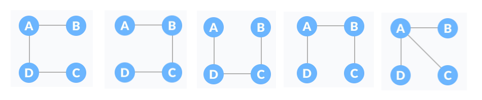

# week8 graph
1. graph
2. tree
3. 위상정렬
4. MST
   1. 프림
   2. 크루스칼
   3. Disjoint-Sets (상호배타 집합) 자료구조, union find
5. 최소경로
   1. 다익스트라
   2. 플로이드 워셜
   3. 벨만 포드


## graph
* Node와 Edge로 이루어진 자료구조
* N:N 관계를 가지는 원소를 표현하는 비선형 자료구조

## graph 종류
* Undirected Graph 무방향 그래프
  * 방향o
* Directed Graph 방향 그래프
  * 방향x
* Cyclic Graph 순환 그래프
  * 사이클o
* Acyclic Graph 비순환 그래프
  * 사이클x
* Complete Graph 완전 그래프
  * 모든 노드가 연결
* Connected Graph 연결 그래프
  * 독립적인 그래프 존재x
* Weighted Graph 가중치 그래프
  * 배열에 가중치 정보 저장
* Simple Graph 단순 그래프
  * 두 정점 사이의 간선이 1개 이하, 루프 존재x
* 루프가 있는 경우도 그래프!
  * loop : 자기자신으로 연결된 간선
* 연결이 되어 있지 않은 경우도 그래프!

### 예시
* DAG Directed Acyclic Graph 방향 비순환 그래프


## graph 표현
* indegree 진입차수 : 들어오는 간선 수
* outdegree 진출차수 : 나가는 간선 수
* 인접 행렬
  * sparse 0이 많아 메모리 낭비
  * 두 점의 연결여부를 자주 확인해야할 때
  * E가 V^2에 가까울 때
* 인접 리스트
  * 특정 정점에 연결된 모든 정점을 자주 확인할 때
  * E가 V^2보다 훨씬 작을 때
* 간선 배열

## graph 탐색
* DFS 깊이 우선 탐색
* BFS 너비 우선 탐색

## tree
* Unidrected Acyclic Connected Graph
* 무방향 비순환 연결 그래프
* 그래프의 한 종류
* Node와 Edge로 구성되어 상하위 관계를 나타내는 자료구조
* 1:N 관계를 가지는 원소를 표현하는 비선형 자료구조

## tree 종류
* binary tree 이진 트리
  * 모든 노드들이 2개의 서브트리를 가지는 형태
* full binary tree 포화 이진 트리
  * 
  * 부모 노드가 자식 노드를 2개 가지거나 하나도 가지지 않는 이진 트리
* perfect binary tree
  * 
  * 모든 부모 노드가 자식 노드를 가지고, 모든 리프 노드의 level이 동일한 이진 트리
* complete binary tree 완전 이진 트리
  * 
  * 빈자리 없이 순서대로 채워지는 이진 트리
* skewed binary tree 편향 이진 트리
  * 
  * 한쪽 방향으로만, 자식 노드를 하나만 가지는 이진트리
* degenerate tree 
  * 
  * 왼쪽이나 오른쪽 방향으로, 자식 노드를 하나만 가지는 이진 트리


## tree 표현
* 인접 행렬
* 인접 배열
* left_child/right_child 배열

## 이진 트리 탐색
* Level-order Traversal 레벨 순회
  * Level순서대로 순회, root에서부터 BFS
* Preorder Traversal 전위 순회
* Inorder Traversal 중위 순회
* Postorder Traversal 후위 순회

## Topological Sort 위상 정렬
* 
* 비순환 방향 그래프에서 간선으로 주어진 정점 간 선후관계를 위배하지 않는 정렬
* 선후관계가 주어진 상태에서 순서를 정해야하는 문제
* DAG (Directed Acyclic Graph)에서만 정의 됨
* 사이클이 존재하면 위상 정렬에 모든 정점이 포함되지 않게 됨
  * 위상 정렬을 하고 난 결과에 모든 정점이 존재하지 않다면 -> 사이클이 존재
* O(V+E)
* ex)
  * 5, 7, 3, 11, 8, 2, 9, 10
  * 3, 5, 7, 8, 11, 2, 9, 10
  * 7, 5, 11, 3, 10, 8, 9, 2

### 구현
1. 정점들의 indegree정보를 담은 배열 저장
2. indegree가 0인 정점들을 큐에 저장
3. 이 정점들 중 하나를 선택하여 큐에서 pop하여 위상 정렬
4. 정렬된 정점과 연결된 모든 정점의 indegree 배열 값 --
5. 이 때, 만약 indegree 값이 0이 된다면 큐에 append
6. 큐가 빌 때까지 반복
```python
from collections import deque

def topologySort():
    ret = []
    queue = deque()
    for i in range(1, N+1):                 # indegree가 0인 정점 큐에 추가
        if indegree[i] == 0:
            queue.append(i)

    while queue:                            # 큐가 빌 때 까지
        now = queue.popleft()               # 큐에서 꺼내 위상 정렬
        ret.append(now)
        for nxt in graph[now]:              # 해당 정점과 연결된 간선 제거
            indegree[nxt] -= 1
            if indegree[nxt] == 0:          # 새롭게 진입차수가 0이된 정점 큐에 추가
                queue.append(nxt)

    return ret

N, E = map(int, input().split())
graph = [[] for _ in range(N+1)]
indegree = [0]*(N+1)
for _ in range(E):
    u, v = map(int, input().split())
    graph[u].append(v)                      # 인접 리스트
    indegree[v] += 1                        # 진입차수 배열 생성

print(topologySort())
```

#### 예제
* boj 2252
* https://www.acmicpc.net/problem/2252

## Spanning Tree 신장 트리
* 
* 
* 방향이 없는 그래프의 부분 그래프들 중에서 모든 정점을 포함하는 트리
* V개의 정점과 V-1개의 간선으로 연결
* 사이클 존재x

## MST Minimum Spanning Tree 최소 신장 트리
* 
* 무방향 가중치 그래프의 신장 트리 중에서 간선의 합이 최소인 트리
* 그래프에서 최소 비용을 찾는 문제

### 표현
* 인접 행렬 + 가중치
* 인접 리스트 + 가중치
* 간선 배열 + 가중치
* 부모 정보 저장(트리) + 가중치

### 연습


## 프림 알고리즘
* 하나의 정점에서 연결된 간선들 중 최소 비용의 간선을 선택해나가는 알고리즘
* 임의의 한 점에서 시작해서, 매번 가장 낮은 비용의 간선을 선택해서 뻗어나가는 그리디 알고리즘
* 운선 순위 큐로 구현
1. 임의의 정점 선택해서 최소 신장 트리에 추가
2. 최소 신장 트리에 포함된 정점에서 포함되지 않은 인접 정점을 연결하는 간선들 중,
3. 비용이 가장 작은 간선을 선택하여 연결되는 정점을 최소 신장 트리에 추가
4. 최소 신장 트리에 V-1개의 간선이 추가될 때 까지 반복

### 구현
1. 임의의 정점 선택해서 최소 신장 트리에 추가
2. 해당 정점과 연결된 모든 간선을 우선순위 큐에 추가
3. 우선순위 큐에서 비용이 가장 작은 간선을 pop 해서
4. 해당 간선이 최소 신장 트리에 포함된 두 정점을 연결한다면, 넘어가기
5. 최소 신장 트리에 포함된 u와 포함되지 않은 v를 연결한다면, 
   1. 해당 간선과 정점 v를 최소 신장 트리에 추가
   2. 정점 v와 최소 신장 트리에 포함되지 않은 정점을 연결하는 모든 간선을 우선순위 큐에 추가
6. 최소 신장 트리에 V-1개의 간선이 추가될 때 까지 반복
```python
from heapq import*

def prim(start):
    visited[start] = True
    ret = 0
    h = []
    for w, v in graph[start]:
        heappush(h, (w, v))             # u와 연결된 간선 우선순위 큐 추가

    cnt = 0
    while cnt < N-1:                    # N-1개의 간선이 추가될 때 까지 반복
        w, v = heappop(h)
        if visited[v]:                  # 최소신장트리에 포함된 정점을 연결하는 간선이면 continue
            continue
        ret += w                        # 포함되지 않은 정점을 연결하는 간선이면, 최소신장트리에 추가
        visited[v] = True
        cnt += 1
        for nw, nv in graph[v]:
            if not visited[nv]:         # 최소 신장 트리에 포함되지 않은 정점을 연결하는 모든 간선을
                heappush(h, (nw, nv))   # 우선순위 큐에 추가

    return ret

N, E = map(int, input().split())
graph = [[] for _ in range(N)]
for _ in range(E):
    u, v, w = map(int, input().split())
    graph[u].append((w, v))
    graph[v].append((w, u))

visited = [False]*(N)
print(prim(0))                          # 시작점 0 선택
```

### 구현 예시 (우선 순위 큐 사용x)
```python
def prim1(r, V):
    MST = [0]*(V+1)                             # MST 포함 여부
    key = [10000]*(V+1)
    key[r] = 0                                  # 시작 가중치 0
    for _ in range(V):
        u = 0
        minV = 10000
        for i in range(V+1):
            if MST[i] == 0 and key[i] < minV:   # MST에 포함되지 않은 정점 중, key가 최소인 u 찾기
                u = i
                minV = key[i]
        MST[u] = 1                              # 정점u MST에 추가

        for v in range(V+1):
            if MST[v] == 0 and adj[u][v] > 0:   # u의 인접 정점 v 중, MST에 포함되지 않았다면
                key[v] = min(key[v], adj[u][v]) # 기존 비용과 u-v 비용 중 최소 업데이트
    
    return sum(key)

V, E = map(int, input().split())
adj = [[0]*(V+1) for _ in range(V+1)]
edge = []
for _ in range(E):
    u, v, w = map(int, input().split())
    adj[u][v] = w                               # 인접 행렬
    adj[v][u] = w

print(prim1(0, V))
```
```python
def prim2(r, V):
    MST = [0]*(V+1)                             # MST 포함 여부
    MST[r] = 1
    s = 0                                       # 가중치의 합
    for _ in range(V):
        u = 0
        minV = 10000
        for i in range(V+1):
            if MST[i] == 1:                     # MST 포함된 정점 i와
                for j in range(V+1):            # MST에 포함되지 않은 i에 인접한 정점j 중에서
                    if adj[i][j] > 0 and MST[j] == 0 and minV > adj[i][j]:
                        u = j                   # 가중치가 최소인 정점 u 찾아서 저장
                        minV = adj[i][j]
        s += minV
        MST[u] = 1
    return s

V, E = map(int, input().split())
adj = [[0]*(V+1) for _ in range(V+1)]
edge = []
for _ in range(E):
    u, v, w = map(int, input().split())
    adj[u][v] = w                               # 인접 행렬
    adj[v][u] = w

print(prim2(0, V))
```
* 시간복잡도 비교

## 크루스칼 알고리즘
* 가장 낮은 비용의 간선부터 오름차순으로 탐색하면서, 간선의 정점들을 합쳐나가는 알고리즘
* 사이클을 만들지 않으면서, 비용이 작은 간선부터 차례대로 최소 신장 트리에 추가하는 그리디 알고리즘
* Disjoint Sets 서로소 집합(혹은 Union Find) 자료구조로 구현
1. 간선 비용을 오름차순으로 정렬 후, 가장 낮은 비용부터 순서대로 탐색
2. 해당 간선이 사이클을 발생한다면 넘어가기
3. 해당 간선이 사이클을 발생하지 않는다면 최소 신장 트리에 추가
4. 모든 간선에 대해 반복

### 구현
1. 간선 비용을 오름차순으로 정렬 후, 가장 낮은 비용부터 순서대로 탐색
2. 간선으로 연결하는 정점 u, v가 같은 그룹이라면 그냥 넘어가기
3. 다른 그룹이라면, u와 v를 같은 그룹으로 만들고 해당 간선을 최소 신장 트리에 추가
4. 최소 신장 트리에 V-1개의 간선을 추가할 때 까지 반복
```python
def find(x):                                    # 부모 찾기
    if p[x] < 0:
        return x
    p[x] = find(p[x])
    return p[x]

def union(u, v):                                # 합치기
    pu = find(u)
    pv = find(v)
    if p[pu] == p[pv]:                          # 랭크가 같다면 한쪽을 -1
        p[pu] -= 1
    if p[pu] < p[pv]:                           # 랭크가 낮은 쪽으로 합치기
        p[pv] = pu
    else:
        p[pu] = pv

def kruskal():
    ret = 0
    for w, u, v in edge:
        if find(u) == find(v):                  # 같은 그룹이면 continue
            continue
        ret += w                                # 다른 그룹이면 최소 신장 트리 추가
        union(u, v)                             # 같은 그룹으로 변경

    return ret

N, E = map(int, input().split())
edge = []
for _ in range(E):
    u, v, w = map(int, input().split())
    edge.append((w, u, v))                      # 간선 배열

edge.sort()                                     # 비용 기준으로 오름차순
p = [-1]*(N+1)                                  # 부모 배열, rank -1로 초기화

print(kruskal())
```

### 구현 예시
```python
def find_set(x):                                # 대표 원소 찾기
    while x != rep[x]:
        x = rep[x]
    return x

def union(x, y):                                # 대표 원소 바꾸기
    rep[find_set(y)] = find_set(x)

def kruskal():
    N = V+1                                     # 노드 수
    cnt = 0
    total = 0
    for u, v, w in edge:                        # 간선 중에서
        if find_set(u) != find_set(v):          # 사이클을 형성하지 않으면
            cnt += 1
            union(u, v)                         # 대표 원소 바꾸기
            total += w                          # 가중치 더하기
            if cnt == N-1:
                return total

V, E = map(int, input().split())
edge = []
for _ in range(E):
    u, v, w = map(int, input().split())
    edge.append([u, v, w])                      # 간선 배열

edge.sort(key=lambda x:x[2])                    # 비용으로 오름차순
rep = [i for i in range(V+1)]                   # 대표원소 초기화

print(kruskal())
```

### 예제
* boj 1197
* https://www.acmicpc.net/problem/1197